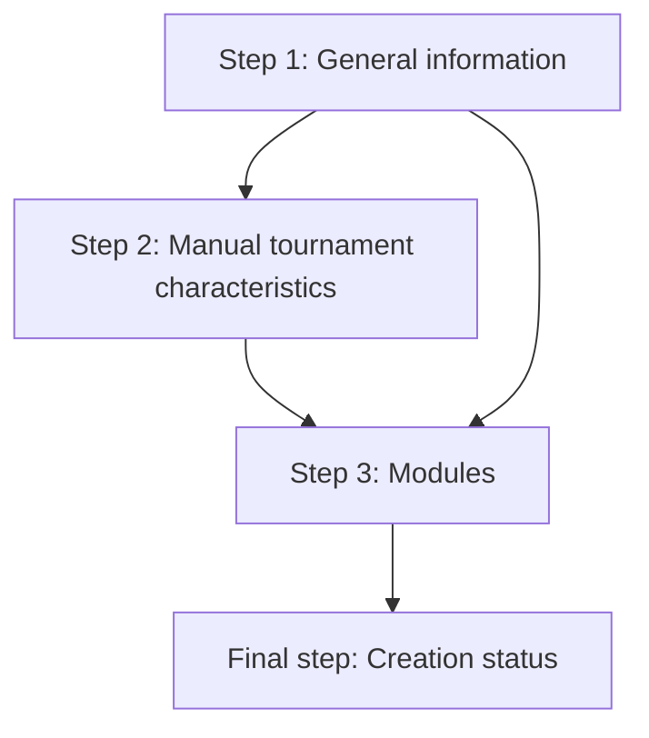

# Tournament Wizard

Last updated: 2026-08-31

## Objective

Provide a modal, step-based wizard for creating and initially configuring a tournament.

## Scope

### In scope

- A PrimeNG stepper displayed inside a modal dialog.
- Progressive tournament information collection, with values retained when navigating back to a previous step.
- FIT Import, Draw Designer, and Manual/import match-definition modes.
- Manual tournament characteristics: start date, duration, number of fields, and divisions.
- Tournament module selection.
- Creation and initial configuration of the persistent `Tournament` and current user's tournament-manager attendee.
- A final creation-status page and navigation to the appropriate next page.

### Out of scope

- Implementing the Draw Designer itself; when required, a placeholder page may be displayed.
- Implementing FIT data import itself; the existing FIT Import module handles the next step.
- Defining individual matches or importing match CSV data in this wizard.

## Functional requirements

### Wizard state and navigation

- The wizard shall use a `TournamentWizardData` object to hold all answers until creation is completed.
- Returning to a previous step shall restore the values entered by the user as the form defaults.
- A step must be completed before the user can proceed to the next step.
- Previous and Next buttons shall allow navigation between applicable steps.
- The final step shall rename the Next button to `Create Tournament`.

The applicable flow is:

### Step 1: General information

The step shall contain:

- A welcome message.
- A form for the tournament name and country.
- A form for the tournament time zone.
- A radio-button question for the match-definition mode.
- A question asking whether the current user is also a Referee Coach (`role = 'COACH'`).

The tournament name shall contain a two- or four-digit year corresponding to the current year or the following year.

The country selector shall follow the existing tournament-edit country widget.

The available match-definition modes are:

- `FIT Import`: after the wizard, the FIT Import module imports days, timeslots, divisions, teams, fields, and games.
- `Draw Designer`: the draw is constructed in the application; the feature is not currently implemented.
- `Manual / import`: the user defines games one by one or through CSV import.

If the selected mode is `FIT Import`, Step 2 shall be skipped and the wizard shall go directly to Step 3. Otherwise, Step 2 shall be displayed.

### Step 2: Manual tournament characteristics

This step shall be displayed only for non-FIT match-definition modes and shall contain:

- Start date, using a PrimeNG date picker.
- Tournament duration, an integer from 1 to 10 days.
- Number of fields, an integer from 1 to 30.
- Default values shall be one tournament day, the next Saturday as start date, two fields, and division `XO`.
- Division checkboxes arranged in four rows:
  - `MO`, `M30`, `M35`, `M40`, `M45`, `M50`, `M55`.
  - `WO`, `W27`, `W35`, `W40`.
  - `XO`, `X30`.
  - `Open`.

### Step 3: Modules and features

The step shall display a three-column table containing a PrimeNG checkbox, the feature name, and its description.

The available features are:

- `Ranking`: ranking of the top N referees by Referee Coaches.
- `Upgrade`: determination of referee upgrades for referees seeking the next badge.
- `Scorecard`: printable pre-filled score sheets containing teams, players, match information, and referees.
- `Draw Designer`: construction of the sporting formula for each division and allocation of games.
- `Online Water Carrier`: referees can self-allocate to games as Water Carriers.
- `Printed Water Carrier`: print a game-allocation schedule with cells to manually assign Water Carriers.
- `Auto allocation`: a configurable algorithm allocates referees and Referee Coaches to games.
- `FIT Import`: import games from an international competition organized by FIT.

The `FIT Import` checkbox shall not be editable in this step. Its value shall be determined by the Step 1 match-definition mode. When `FIT Import` is selected in Step 1, the `Draw Designer` checkbox shall also be unchecked and not editable.

`FIT Import` and `Draw Designer` are mutually exclusive. Selecting one shall automatically clear the other without displaying an additional message.

### Final step: Creation status

- On entry, display a message indicating that the tournament is being created and show a small spinner.
- After all creation and configuration actions complete successfully, replace the progress message with a success message.
- If the match-definition mode is `FIT Import`, indicate that FIT data import is the next step.
- If the match-definition mode is `Draw Designer`, indicate that the next step is to define the draw in the designer.
- The final step shall have no Previous or Next button. It shall have one `Close` button, displayed after successful creation or after a creation error.
- After closing the modal, navigate as follows:
  - `FIT Import`: the FIT Import page.
  - `Draw Designer`: the Draw Designer page, or an empty placeholder page until the feature exists.
  - Otherwise: the tournament home page.

## Business rules

- The tournament country determines the tournament region.
- The current user becomes a tournament manager.
- The current user is listed in the tournament manager data.
- An `Attendee` is created for the current user with tournament-manager rights and, when selected in Step 1, Referee Coach rights.
- Selected modules shall be stored in `Tournament.enablesModules`.
- The creation operation shall create the `Tournament` in memory, populate it from `TournamentWizardData`, and persist it to Firestore through `TournamentService`.

## User interface and workflow

- The wizard shall be presented as a modal dialog containing a PrimeNG stepper.
- The country selector shall be consistent with the existing tournament-edit page.
- Validation feedback uses inline step gating; creation and validation status messages are displayed in English in the final step.
- Closing the wizard before creation shall be allowed and shall abandon all entered data without creating a tournament.

## Data model and persistence

The wizard state shall at least represent:

- Tournament name.
- Country.
- Time zone.
- Match-definition mode.
- Whether the current user is also a Referee Coach.
- For non-FIT modes: start date, number of days, number of fields, and selected divisions.
- Selected modules.

The existing model provides the following target fields:

- `Tournament.name`, `countryId`, `regionId`, `startDate`, `endDate`, `nbDay`, `fields`, `divisions`, and optional `enablesModules`.
- `Tournament.managerAttendeeIds` and `managerEmails` for manager membership.
- `Attendee.isTournamentManager` and `Attendee.isRefereeCoach` for the current user's rights.
- `ModulesNames` values including `RANKING`, `UPGRADE`, `DRAW_DESIGNER`, `AUTOMATIC_ALLOCATION`, `FIT_IMPORT`, `SCORECARD`, `PRINTED_WATER_CARRIER`, and `ONLINE_WATER_CARRIER`.

`TournamentWizardData` is an internal interface in `frontend/src/page/tournament-wizard.page.ts`. Creation uses `TournamentService.createWithManager()`, which writes the tournament and initial attendee in one Firestore transaction. For properties not collected by the wizard, reuse the existing defaults from `buildDefaultTournament` in `frontend/src/page/tournament-edit.page.ts`, except that the time zone shall be collected in Step 1.

For non-FIT tournaments, generated days, fields, divisions, and timeslots shall follow the existing tournament-creation logic in `frontend/src/page/tournament-edit.page.ts`.

For a one-day tournament, the day shall be split into two parts at midday. The existing total number and duration of generated timeslots shall be preserved, and timeslots shall be assigned to the morning or afternoon part according to their position around midday. Generated field names shall be `1`, `2`, `3`, and so on, according to the requested field count. Each selected division shall contain four default teams.

## Errors, validation, and permissions

- The tournament name must contain a valid current or next year in two- or four-digit form.
- Duration must be an integer from 1 through 10.
- Number of fields must be an integer from 1 through 30.
- Tournament name, country, time zone, match-definition mode, and Referee Coach answer are required. No division is required for non-FIT modes. For FIT Import, divisions and teams are determined by the imported FIT data.
- The current user must be authorized to create the tournament and must be persisted as its manager and attendee.
- Creation errors shall be displayed on the final step without a retry action. The wizard shall remain open and provide only a `Close` button after an error. Creation of the tournament and current-user attendee shall be atomic; no partial data shall remain persisted if either creation fails.

## Compatibility and migration

- Reuse the existing `Tournament` and `Attendee` persistence model and `TournamentService`.
- No migration is currently specified.
- The impact on existing tournament creation from `tournament-edit.page.ts` and compatibility with existing Firestore rules are `To be verified during implementation`.

## Acceptance criteria

- A user can open the wizard in a modal and complete the applicable steps in order.
- Returning to a previous step restores the previously entered values.
- FIT Import skips the manual-characteristics step; other modes display it.
- The configured validations prevent invalid tournament names, durations, and field counts from proceeding.
- Module selection persists the expected `ModulesNames` values, including the FIT Import value derived from Step 1.
- FIT Import and Draw Designer cannot both remain selected.
- Successful creation persists a tournament with the selected country, derived region, manager membership, current-user attendee rights, and enabled modules.
- The final step shows progress, then success and the appropriate next-step message; `Close` is available only after success.
- Closing after success navigates to the page corresponding to the selected match-definition mode.
- Creation errors are shown on the final step without a retry button.

## Open decisions

- Exact validation copy remains an implementation-level UI detail.
- Error layout is the final status panel with a single `Close` button and no retry.

## Spec analysis

### Readiness

Ready for implementation

### Summary

The user flow, generated manual tournament data, persistence defaults, cancellation behavior, and failure atomicity are defined. The exact TypeScript shape of the transient `TournamentWizardData` object and exact copy for validation/status messages remain implementation-level details and do not block implementation.

### Verified impacts

| Area | Evidence | Expected impact |
|---|---|---|
| Shared model | `persistent-data-model/src/tournament.ts` | Reuse `Tournament`, `Attendee`, and `ModulesNames`; no new persistence field is explicitly required by the current spec. |
| Frontend | `frontend/src/page/tournament-edit.page.ts`, `frontend/src/service/region.service.ts` | Reuse country-to-region behavior and align creation/navigation with existing tournament pages. |
| Navigation | `frontend/src/app/app.routes.ts`, existing tournament pages | FIT Import uses the existing route; Draw Designer uses `tournament/:tournamentId/draw-designer` until the designer exists. |
| Documentation | `doc/datamodel.md`, `doc/features.md` | These documents must be reviewed and updated if the implementation changes persisted fields or user-visible workflow. |

### Remaining assumptions

- The wizard is a new creation flow and does not remove or silently alter the existing tournament-edit creation path.
- The existing country widget and region service are authoritative for country/region mapping.
- `TournamentWizardData` may be shaped as an internal typed interface matching the fields listed in the data-model section.

### Recommended implementation breakdown

1. Define the internal `TournamentWizardData` interface and explicit defaults.
2. Implement the modal stepper and typed validation.
3. Implement tournament and attendee mapping/persistence.
4. Implement creation-status handling and post-success routing.
5. Add tests and update affected documentation.

### Recommended checks

- Verify current and next-year name validation for two- and four-digit years.
- Verify conditional step navigation and state restoration.
- Verify module exclusivity and FIT Import immutability.
- Verify persisted manager arrays, attendee flags, country/region, and enabled modules.
- Verify successful and failed creation flows and destination routing.
