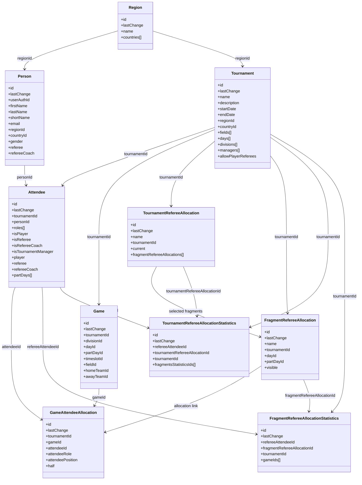

# Modele de donnees persistant

## Principes generaux

Tous les objets persistants partagent la meme base :

- `id` : identifiant unique.
- `lastChange` : horodatage de derniere modification.

Les noms de collections Firestore declares dans le code sont :

- `region`
- `person`
- `email_personid`
- `tournament`
- `attendee`
- `game`
- `game-attendee-allocation`
- `tournament-referee-allocation`
- `fragment-referee-allocation`
- `tournament-referee-allocation-statistics`
- `fragment-referee-allocation-statistics`

## Objets metier persistants

## `Region`

Reference geographique.

Champs principaux :

- `name`
- `countries[]`

Un `Country` contient `id`, `name`, `shortName` et eventuellement `badgeSystem`.

Usage :

- sert a alimenter les listes pays/regions du front
- relie les `Person` et les `Tournament` a une zone geographique

## `Person`

Identite reutilisable d'un utilisateur ou d'un officiel.

Champs principaux :

- `userAuthId`
- `firstName`, `lastName`, `shortName`
- `email`, `phone`, `photoUrl`
- `regionId`, `countryId`
- `gender`
- `referee`
- `refereeCoach`

Usage :

- support des comptes utilisateurs
- fiche signaletique d'un arbitre temps plein ou d'un coach d'arbitres

## `EmailPersonId`

Index technique gere uniquement par le backend.

Champs principaux :

- identifiant du document : email de la personne
- `personId`

Usage :

- garantir l'unicite de l'email a la creation d'une `Person`
- retrouver rapidement l'identifiant de la personne associee a un email

Contrainte :

- l'index n'est cree que lorsque l'email est non vide
- plusieurs `Person` sans email restent donc possibles

## `Tournament`

Agregat principal de l'application.

Champs principaux :

- informations generales : `name`, `description`, `venue`, `city`, `timeZone`
- dates : `startDate`, `endDate`, `nbDay`
- localisation : `countryId`, `regionId`
- structure : `fields[]`, `days[]`, `divisions[]`
- gouvernance : `managers[]`
- etat courant : `currentScheduleId`, `currentDrawId`
- configuration arbitrage : `allowPlayerReferees`

Sous-objets embarques :

- `Field` : terrain, qualite, video, ordre d'affichage
- `Day`
- `PartDay`
- `Timeslot`
- `Division`
- `Team`
- `TournamentManager`

Dans l'etat actuel du projet, une grande partie du parametage du tournoi est embarquee dans le document `Tournament` plutot que stockee dans des sous-collections.

## `Attendee`

Participation d'une personne a un tournoi.

Champs principaux :

- `tournamentId`
- `personId`
- `roles[]`
- indicateurs `isPlayer`, `isReferee`, `isRefereeCoach`, `isTournamentManager`
- `player`
- `referee`
- `refereeCoach`
- `partDays[]`
- `comments`

Usage :

- associe une `Person` a un `Tournament`
- porte les roles effectifs dans le tournoi
- permet aussi les player referees via `isPlayer = true` et `isReferee = true`

## `Game`

Match planifie dans un tournoi.

Champs principaux :

- `tournamentId`
- `scheduleId`
- `divisionId`
- `dayId`, `partDayId`, `timeslotId`, `fieldId`
- `homeTeamId`, `awayTeamId`
- `score`
- `scheduleInfo`

Usage :

- grille des matchs par jour / part / terrain / slot
- support de l'allocation des arbitres et des coaches d'arbitres

## `GameAttendeeAllocation`

Affectation d'un `Attendee` sur un match.

Champs principaux :

- `tournamentId`
- `fragmentRefereeAllocationId` dans le modele partage
- `gameId`
- `attendeeId`
- `attendeeRole`
- `attendeePosition`
- `half`

Attention :

- le front et le backend requetent aussi un champ `refereeAllocationId`
- le type partage expose `fragmentRefereeAllocationId`

La documentation fonctionnelle doit donc considerer qu'il s'agit de la liaison entre un match et un fragment d'allocation, meme si le nom du champ n'est pas entierement aligne dans le code.

## `TournamentRefereeAllocation`

Scenario global d'allocation d'arbitres sur un tournoi.

Champs principaux :

- `name`
- `tournamentId`
- `current`
- `fragmentRefereeAllocations[]`

Usage :

- permet de conserver plusieurs hypotheses d'allocation pour un meme tournoi
- une seule allocation peut etre marquee `current = true`

## `FragmentRefereeAllocation`

Fragment reutilisable d'allocation, au niveau d'un jour complet ou d'une partie de journee.

Champs principaux :

- `name`
- `tournamentId`
- `dayId`
- `partDayId` optionnel
- `refereeAllocatorAttendeeIds[]`
- `refereeCoachAllocatorAttendeeIds[]`
- `visible`

Usage :

- brique elementaire des allocations
- selectionnee dans un `TournamentRefereeAllocation`

## `FragmentRefereeAllocationStatistics`

Statistiques calculees pour un arbitre sur un fragment.

Champs principaux :

- `refereeAttendeeId`
- `fragmentRefereeAllocationId`
- `tournamentId`
- `dayId`, `partDayId`
- `gameIds[]`
- `nbGamesOnBadField`
- `nbGamesOnVideo`
- `firstTimeSlotIdx`, `lastTimeSlotIdx`
- `coaching`
- `buddies[]`
- `teams[]`
- `games[]`

## `TournamentRefereeAllocationStatistics`

Agregation des statistiques d'un arbitre sur l'ensemble d'une allocation tournoi.

Champs principaux :

- `refereeAttendeeId`
- `tournamentId`
- `tournamentRefereeAllocationId`
- `tournamentStatistics`
- `fragmentsStatisticsIds[]`

## Objets metier presents dans le package mais non relies a une collection explicite

Le package partage contient aussi :

- `Schedule`
- `Draw`
- `DivisionDraw`
- `Step`
- `Group`
- `Round`
- `RoundGame`
- `GameEvent`

Ces types decrivent le domaine, mais le depot actuel ne declare pas de collection Firestore, de service front ni de backend Firebase dedie pour eux. Ils semblent preparer des evolutions futures autour du tirage et de la planification.

## Diagramme Mermaid

## Resume fonctionnel

Le coeur persistant actuel du projet repose sur 4 axes :

1. referentiel : `Region`, `Person`
2. index d'unicite : `EmailPersonId`
3. configuration de tournoi : `Tournament`
4. exploitation : `Attendee`, `Game`, `GameAttendeeAllocation`
5. arbitrage : `TournamentRefereeAllocation`, `FragmentRefereeAllocation` et leurs statistiques
