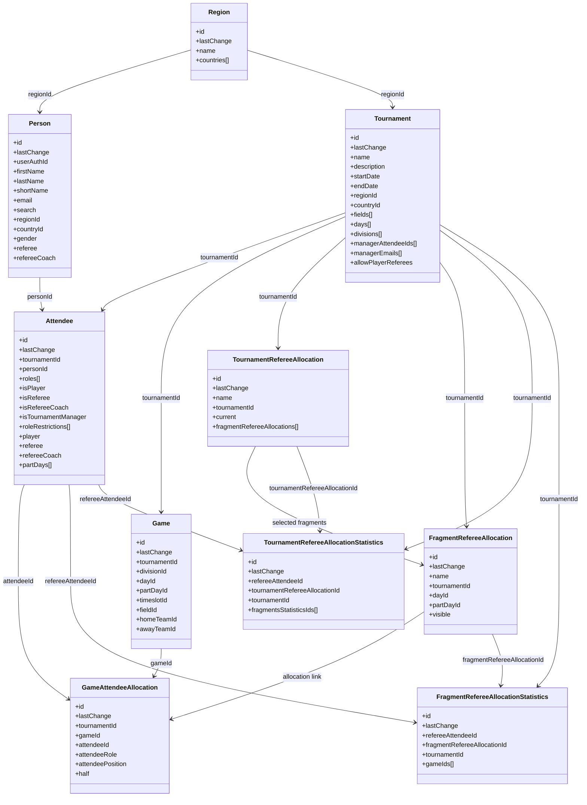

# Modele de donnees persistant

## Principes generaux

Tous les objets persistants partagent la meme base :

- `id` : identifiant unique.
- `lastChange` : horodatage de derniere modification.

Les noms de collections Firestore declares dans le code sont :

- `region`
- `PlaformAdmin`
- `person`
- `email_personid`
- `tournament`
- `fit-data`
- `attendee`
- `game`
- `game-attendee-allocation`
- `tournament-referee-allocation`
- `fragment-referee-allocation`
- `tournament-referee-allocation-statistics`
- `fragment-referee-allocation-statistics`

## Objets metier persistants

## `Region`

Reference geographique.

Champs principaux :

- `name`
- `countries[]`

Un `Country` contient `id`, `name`, `shortName` et eventuellement `badgeSystem`.

Usage :

- sert a alimenter les listes pays/regions du front
- relie les `Person` et les `Tournament` a une zone geographique

## `PlaformAdmin`

Administrateur de la plateforme.

Contraintes :

- l'identifiant du document est l'email de l'administrateur ;
- la lecture publique de `Region` est autorisée ;
- la création, la modification et la suppression de `Region` sont réservées aux utilisateurs authentifiés dont l'email correspond à un document `PlaformAdmin` ;
- un `PlaformAdmin` peut également modifier ou supprimer un `Tournament` ;
- la collection `PlaformAdmin` est inaccessible depuis le client et doit être administrée par un backend ou un outil d'administration sécurisé.

## `Person`

Identite reutilisable d'un utilisateur ou d'un officiel.

Champs principaux :

- `userAuthId`
- `firstName`, `lastName`, `shortName`
- `email`, `phone`, `photoUrl`
- `search`
- `regionId`, `countryId`
- `gender`
- `referee`
- `refereeCoach`

Usage :

- support des comptes utilisateurs
- fiche signaletique d'un arbitre temps plein ou d'un coach d'arbitres

Droits :

- une personne authentifiée peut modifier uniquement le document `Person` dont l'email correspond à son email authentifié ;
- un `PlaformAdmin` peut modifier toute personne ;
- la création et la suppression restent soumises aux règles Firestore générales actuelles.

Contrainte :

- `search` est un champ denormalise mis a jour a chaque creation ou modification
- sa valeur est la concatenation de `firstName`, `lastName`, `shortName` et `email`, separes par un espace

## `EmailPersonId`

Index technique gere uniquement par le backend.

Champs principaux :

- identifiant du document : email de la personne
- `personId`

Usage :

- garantir l'unicite de l'email a la creation d'une `Person`
- retrouver rapidement l'identifiant de la personne associee a un email

Contrainte :

- l'index n'est cree que lorsque l'email est non vide
- plusieurs `Person` sans email restent donc possibles

## `Tournament`

Agregat principal de l'application.

Champs principaux :

- informations generales : `name`, `description`, `venue`, `city`, `timeZone`
- dates : `startDate`, `endDate`, `nbDay`
- localisation : `countryId`, `regionId`
- structure : `fields[]`, `days[]`, `divisions[]`
- gouvernance : `managerAttendeeIds[]`, `managerEmails[]`
- etat courant : `currentScheduleId`, `currentDrawId`
- configuration arbitrage : `allowPlayerReferees`

Sous-objets embarques :

- `Field` : terrain, qualite, video, ordre d'affichage
- `Day`
- `PartDay`
- `Timeslot`
- `Division`
- `Team`

`managerAttendeeIds[]` contient les identifiants des participants qui administrent le tournoi. `managerEmails[]` contient les adresses email de tous les managers, qu'ils soient associés ou non à une `Person`/un `Attendee` ; il est utilisé par les règles Firestore pour autoriser la création, la modification et la suppression du tournoi. Un manager associé à un attendee doit donc être présent dans les deux listes, tandis qu'un manager uniquement identifié par son email est présent uniquement dans `managerEmails[]`.

Dans l'etat actuel du projet, une grande partie du parametage du tournoi est embarquee dans le document `Tournament` plutot que stockee dans des sous-collections.

### Configuration d'import FIT

Le champ optionnel `fit` conserve la sélection FIT (`competitionSlug`, `season`), le fuseau cible IANA (`targetTimeZone`), les renommages personnalisés (`renaming.divisions`, `renaming.teams`, `renaming.fields`, avec `fitName` et `appName`), l'option `capitalizeTeamName` et la date ISO du dernier téléchargement réussi (`lastImportDate`). Les données téléchargées (`FITData`) sont persistées dans la collection `fit-data`, avec un document par téléchargement et un champ `tournamentId`; le snapshot dont `importDate` est le plus récent est restauré au chargement de la page. Les objets `Division` et `Team` peuvent conserver leurs clés FIT (`fitSlug`, `fitDivisionSlug`) pour fiabiliser les imports ultérieurs. Cette phase ne modifie pas les `Game`, `Day`, `Timeslot`, `Field`, `Division` ou `Team` du tournoi.

## `Attendee`

Participation d'une personne a un tournoi.

Champs principaux :

- `tournamentId`
- `personId`
- `roles[]`
- `roleRestrictions[]` (optionnel)
- indicateurs `isPlayer`, `isReferee`, `isRefereeCoach`, `isTournamentManager`
- `player`
- `referee`
- `refereeCoach`
- `partDays[]`
- `comments`

`roleRestrictions[]` précise les limites applicables à un rôle porté par l'attendee. Chaque restriction contient :

- `role` : rôle concerné
- `dayId` et `partDayId` (optionnels) : périmètre temporel ; l'absence de valeur signifie tous les jours ou toutes les parties
- `divisionIds[]` (optionnel) : divisions autorisées
- `refereeeCategories[]` (optionnel) : catégories d'arbitres autorisées

Les écritures sur `Attendee` sont réservées aux managers du tournoi référencé par `tournamentId` ou à un `PlaformAdmin`. Une mise à jour ne peut pas changer `tournamentId`.

Usage :

- associe une `Person` a un `Tournament`
- porte les roles effectifs dans le tournoi
- permet aussi les player referees via `isPlayer = true` et `isReferee = true`

## `Game`

Match planifie dans un tournoi.

Champs principaux :

- `tournamentId`
- `scheduleId`
- `divisionId`
- `dayId`, `partDayId`, `timeslotId`, `fieldId`
- `homeTeamId`, `awayTeamId`
- `what` : type ou libellé du match, par exemple `Pool`
- `score`
- `scheduleInfo`

Usage :

- grille des matchs par jour / part / terrain / slot
- support de l'allocation des arbitres et des coaches d'arbitres

## `GameAttendeeAllocation`

Affectation d'un `Attendee` sur un match.

Champs principaux :

- `tournamentId`
- `fragmentRefereeAllocationId` dans le modele partage
- `gameId`
- `attendeeId`
- `attendeeRole`
- `attendeePosition`
- `half`

Attention :

- le front et le backend requetent aussi un champ `refereeAllocationId`
- le type partage expose `fragmentRefereeAllocationId`

La documentation fonctionnelle doit donc considerer qu'il s'agit de la liaison entre un match et un fragment d'allocation, meme si le nom du champ n'est pas entierement aligne dans le code.

## `TournamentRefereeAllocation`

Scenario global d'allocation d'arbitres sur un tournoi.

Champs principaux :

- `name`
- `tournamentId`
- `current`
- `fragmentRefereeAllocations[]`

Usage :

- permet de conserver plusieurs hypotheses d'allocation pour un meme tournoi
- une seule allocation peut etre marquee `current = true`

## `FragmentRefereeAllocation`

Fragment reutilisable d'allocation, au niveau d'un jour complet ou d'une partie de journee.

Champs principaux :

- `name`
- `tournamentId`
- `dayId`
- `partDayId` optionnel
- `refereeAllocatorAttendeeIds[]`
- `refereeCoachAllocatorAttendeeIds[]`
- `visible`

Usage :

- brique elementaire des allocations
- selectionnee dans un `TournamentRefereeAllocation`

## `FragmentRefereeAllocationStatistics`

Statistiques calculees pour un arbitre sur un fragment.

Champs principaux :

- `refereeAttendeeId`
- `fragmentRefereeAllocationId`
- `tournamentId`
- `dayId`, `partDayId`
- `gameIds[]`
- `nbGamesOnBadField`
- `nbGamesOnVideo`
- `firstTimeSlotIdx`, `lastTimeSlotIdx`
- `coaching`
- `buddies[]`
- `teams[]`
- `games[]`

## `TournamentRefereeAllocationStatistics`

Agregation des statistiques d'un arbitre sur l'ensemble d'une allocation tournoi.

Champs principaux :

- `refereeAttendeeId`
- `tournamentId`
- `tournamentRefereeAllocationId`
- `tournamentStatistics`
- `fragmentsStatisticsIds[]`

## Objets metier presents dans le package mais non relies a une collection explicite

Le package partage contient aussi :

- `Schedule`
- `Draw`
- `DivisionDraw`
- `Step`
- `Group`
- `Round`
- `RoundGame`
- `GameEvent`

Ces types decrivent le domaine, mais le depot actuel ne declare pas de collection Firestore, de service front ni de backend Firebase dedie pour eux. Ils semblent preparer des evolutions futures autour du tirage et de la planification.

## Diagramme Mermaid

```mermaid
classDiagram
    class Region {
      +id
      +lastChange
      +name
      +countries[]
    }

    class Person {
      +id
      +lastChange
      +userAuthId
      +firstName
      +lastName
      +shortName
      +email
      +search
      +regionId
      +countryId
      +gender
      +referee
      +refereeCoach
    }

    class Tournament {
      +id
      +lastChange
      +name
      +description
      +startDate
      +endDate
      +regionId
      +countryId
      +fields[]
      +days[]
      +divisions[]
      +managerAttendeeIds[]
      +managerEmails[]
      +allowPlayerReferees
    }

    class Attendee {
      +id
      +lastChange
      +tournamentId
      +personId
      +roles[]
      +isPlayer
      +isReferee
      +isRefereeCoach
      +isTournamentManager
      +roleRestrictions[]
      +player
      +referee
      +refereeCoach
      +partDays[]
    }

    class Game {
      +id
      +lastChange
      +tournamentId
      +divisionId
      +dayId
      +partDayId
      +timeslotId
      +fieldId
      +homeTeamId
      +awayTeamId
    }

    class GameAttendeeAllocation {
      +id
      +lastChange
      +tournamentId
      +gameId
      +attendeeId
      +attendeeRole
      +attendeePosition
      +half
    }

    class TournamentRefereeAllocation {
      +id
      +lastChange
      +name
      +tournamentId
      +current
      +fragmentRefereeAllocations[]
    }

    class FragmentRefereeAllocation {
      +id
      +lastChange
      +name
      +tournamentId
      +dayId
      +partDayId
      +visible
    }

    class FragmentRefereeAllocationStatistics {
      +id
      +lastChange
      +refereeAttendeeId
      +fragmentRefereeAllocationId
      +tournamentId
      +gameIds[]
    }

    class TournamentRefereeAllocationStatistics {
      +id
      +lastChange
      +refereeAttendeeId
      +tournamentRefereeAllocationId
      +tournamentId
      +fragmentsStatisticsIds[]
    }

    Region --> Person : regionId
    Region --> Tournament : regionId
    Tournament --> Attendee : tournamentId
    Tournament --> Game : tournamentId
    Tournament --> TournamentRefereeAllocation : tournamentId
    Tournament --> FragmentRefereeAllocation : tournamentId
    Tournament --> TournamentRefereeAllocationStatistics : tournamentId
    Tournament --> FragmentRefereeAllocationStatistics : tournamentId
    Person --> Attendee : personId
    Attendee --> GameAttendeeAllocation : attendeeId
    Game --> GameAttendeeAllocation : gameId
    TournamentRefereeAllocation --> FragmentRefereeAllocation : selected fragments
    FragmentRefereeAllocation --> GameAttendeeAllocation : allocation link
    FragmentRefereeAllocation --> FragmentRefereeAllocationStatistics : fragmentRefereeAllocationId
    TournamentRefereeAllocation --> TournamentRefereeAllocationStatistics : tournamentRefereeAllocationId
    Attendee --> FragmentRefereeAllocationStatistics : refereeAttendeeId
    Attendee --> TournamentRefereeAllocationStatistics : refereeAttendeeId
```

## Resume fonctionnel

Le coeur persistant actuel du projet repose sur 4 axes :

1. referentiel : `Region`, `Person`
2. index d'unicite : `EmailPersonId`
3. configuration de tournoi : `Tournament`
4. exploitation : `Attendee`, `Game`, `GameAttendeeAllocation`
5. arbitrage : `TournamentRefereeAllocation`, `FragmentRefereeAllocation` et leurs statistiques
