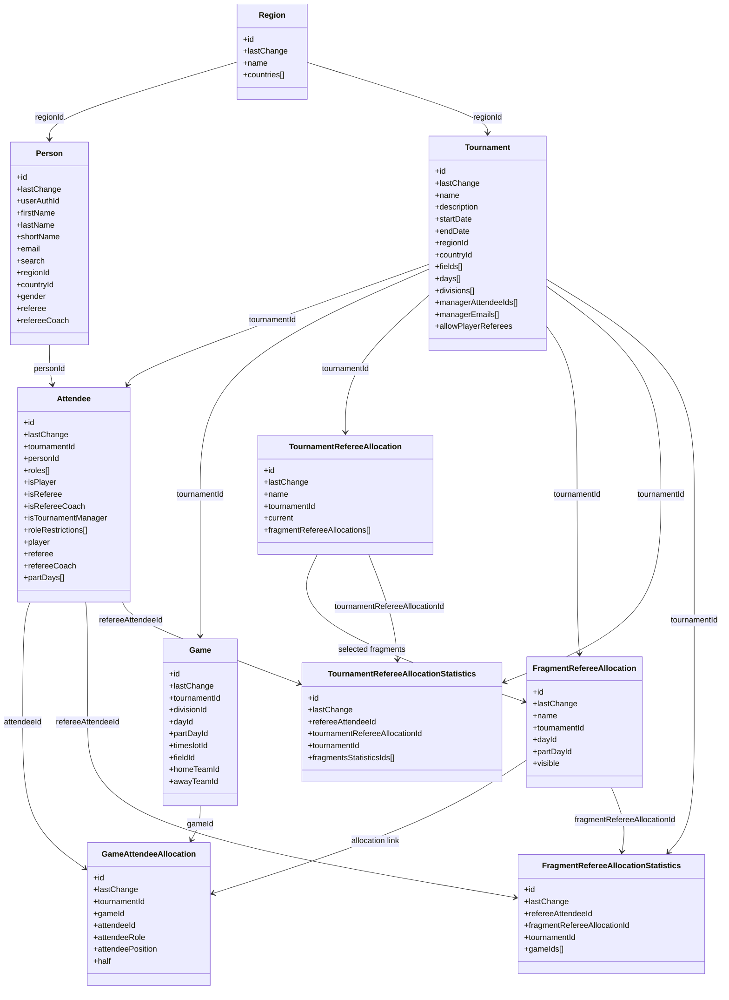

# Modele de donnees persistant

## Principes generaux

Tous les objets persistants partagent la meme base :

- `id` : identifiant unique.
- `lastChange` : horodatage de derniere modification.

Les noms de collections Firestore declares dans le code sont :

- `region`
- `PlaformAdmin`
- `person`
- `email_personid`
- `tournament`
- `fit-data`
- `attendee`
- `game`
- `game-attendee-allocation`
- `tournament-referee-allocation`
- `fragment-referee-allocation`
- `tournament-referee-allocation-statistics`
- `fragment-referee-allocation-statistics`
- `referee-upgrade-coach-vote`
- `referee-upgrade-panel-vote`

## Objets metier persistants

## Votes d'upgrade des arbitres

Le modele partage `persistent-data-model/src/referee-upgrade.ts` definit `UpgradeVote`, `RefereeUpgradeCoachVote` et `RefereeUpgradePanelVote`.

- Un vote coach contient le tournoi, l'arbitre, le coach, une valeur de vote et les lignes de commentaire.
- Un vote panel contient le tournoi, l'arbitre, la decision, le dernier coach auteur, les coaches a revoir et le coach a qui parler (`null` si aucun).
- Les IDs Firestore sont deterministes afin de garantir un vote coach par couple coach/arbitre et un vote panel par arbitre dans un tournoi.
- Au chargement de la page, les votes coach manquants sont initialises uniquement pour le coach connecte ; les votes panel manquants sont initialises pour tous les arbitres eligibles.
- Au chargement de la page, la liste courante des attendees arbitres qui demandent un upgrade est comparee aux identifiants references par les votes. Les votes coach et panel d'un arbitre qui ne demande plus d'upgrade restent persistes, mais sont ignores par la page et ne sont pas recrees.

## `Region`

Reference geographique.

Champs principaux :

- `name`
- `countries[]`

Un `Country` contient `id`, `name`, `shortName` et eventuellement `badgeSystem`.

Usage :

- sert a alimenter les listes pays/regions du front
- relie les `Person` et les `Tournament` a une zone geographique

## `PlaformAdmin`

Administrateur de la plateforme.

Contraintes :

- l'identifiant du document est l'email de l'administrateur ;
- la lecture publique de `Region` est autorisée ;
- la création, la modification et la suppression de `Region` sont réservées aux utilisateurs authentifiés dont l'email correspond à un document `PlaformAdmin` ;
- un `PlaformAdmin` peut également modifier ou supprimer un `Tournament` ;
- la collection `PlaformAdmin` est inaccessible depuis le client et doit être administrée par un backend ou un outil d'administration sécurisé.

## `Person`

Identite reutilisable d'un utilisateur ou d'un officiel.

Champs principaux :

- `userAuthId`
- `firstName`, `lastName`, `shortName`
- `email`, `phone`, `photoUrl`
- `search`
- `regionId`, `countryId`
- `gender`
- `referee`
- `refereeCoach`

Usage :

- support des comptes utilisateurs
- fiche signaletique d'un arbitre temps plein ou d'un coach d'arbitres

Droits :

- une personne authentifiée peut modifier uniquement le document `Person` dont l'email correspond à son email authentifié ;
- un `PlaformAdmin` peut modifier toute personne ;
- la création et la suppression restent soumises aux règles Firestore générales actuelles.

Contrainte :

- `search` est un champ denormalise mis a jour a chaque creation ou modification
- sa valeur est la concatenation de `firstName`, `lastName`, `shortName` et `email`, separes par un espace

## `EmailPersonId`

Index technique gere uniquement par le backend.

Champs principaux :

- identifiant du document : email de la personne
- `personId`

Usage :

- garantir l'unicite de l'email a la creation d'une `Person`
- retrouver rapidement l'identifiant de la personne associee a un email

Contrainte :

- l'index n'est cree que lorsque l'email est non vide
- plusieurs `Person` sans email restent donc possibles

## `Tournament`

Agregat principal de l'application.

Champs principaux :

- informations generales : `name`, `description`, `venue`, `city`, `timeZone`
- dates : `startDate`, `endDate`, `nbDay`
- localisation : `countryId`, `regionId`
- structure : `fields[]`, `days[]`, `divisions[]`
- gouvernance : `managerAttendeeIds[]`, `managerEmails[]`
- etat courant : `currentScheduleId`, `currentDrawId`
- configuration arbitrage : `allowPlayerReferees`

Sous-objets embarques :

- `Field` : terrain, qualite, video, ordre d'affichage
- `Day`
- `PartDay`
- `Timeslot`
- `Division`
- `Team`

Chaque `PartDay` possède un champ `name` affiché dans la configuration du
tournoi. Pour les anciennes données qui ne contiennent pas ce champ, le nom
est initialisé en mémoire avec la valeur de `PartDay.id` lors du chargement.

Les `Timeslot.id` sont des identifiants opaques (UUID) uniques dans leur
`Day`, indépendamment du `PartDay` qui les contient. La clé de résolution
d'un timeslot est `(dayId, timeslotId)` ; déplacer un timeslot entre deux
parts ne modifie pas son identifiant. `Game` conserve `dayId` et
`timeslotId`, mais ne persiste pas `partDayId` : la part se déduit du
timeslot lorsque nécessaire.

`managerAttendeeIds[]` contient les identifiants des participants qui administrent le tournoi. `managerEmails[]` contient les adresses email de tous les managers, qu'ils soient associés ou non à une `Person`/un `Attendee` ; il est utilisé par les règles Firestore pour autoriser la création, la modification et la suppression du tournoi. Un manager associé à un attendee doit donc être présent dans les deux listes, tandis qu'un manager uniquement identifié par son email est présent uniquement dans `managerEmails[]`.

Dans l'etat actuel du projet, une grande partie du parametage du tournoi est embarquee dans le document `Tournament` plutot que stockee dans des sous-collections.

### Configuration d'import FIT

Le champ optionnel `fit` conserve la sélection FIT (`competitionSlug`, `season`), le fuseau cible IANA (`targetTimeZone`), les renommages personnalisés (`renaming.divisions`, `renaming.teams`, `renaming.fields`, avec `fitName` et `appName`), l'option `capitalizeTeamName` et la date ISO du dernier téléchargement réussi (`lastImportDate`). Les données téléchargées (`FITData`) sont persistées dans la collection `fit-data`, avec un document par téléchargement et un champ `tournamentId`; le snapshot dont `importDate` est le plus récent est restauré au chargement de la page. Les objets `Division` et `Team` peuvent conserver leurs clés FIT (`fitSlug`, `fitDivisionSlug`) pour fiabiliser les imports ultérieurs. Cette phase ne modifie pas les `Game`, `Day`, `Timeslot`, `Field`, `Division` ou `Team` du tournoi.

La creation initiale par le tournament wizard ecrit le `Tournament` et
l'`Attendee` du manager dans une transaction Firestore. Les regles autorisent
la creation de cet attendee en consultant l'etat final du tournoi avec
`getAfter()`.

## `Attendee`

Participation d'une personne a un tournoi.

Champs principaux :

- `tournamentId`
- `personId`
- `roles[]`
- `roleRestrictions[]` (optionnel)
- indicateurs `isPlayer`, `isReferee`, `isRefereeCoach`, `isTournamentManager`
- `player`
- `referee`
- `refereeCoach`
- `unavailabilities[]` (optionnel) : exceptions de disponibilité par `dayId` et `timeslotId`
- `partDays[]`
- `comments`

Chaque entrée de `unavailabilities[]` contient `dayId`, `unavailability`
(`TOTAL` ou `PARTIAL`) et `unavailableSlotIds[]`. Les identifiants de slots
sont uniques dans la journée et sont résolus avec `(dayId, timeslotId)`.
L'absence d'une entrée signifie que l'attendee est disponible toute la journée.
Une entrée `TOTAL` utilise une liste de slots vide ; une entrée `PARTIAL`
contient uniquement les slots indisponibles.

`roleRestrictions[]` précise les limites applicables à un rôle porté par l'attendee. Chaque restriction contient :

- `role` : rôle concerné
- `dayId` et `partDayId` (optionnels) : périmètre temporel ; l'absence de valeur signifie tous les jours ou toutes les parties
- `divisionIds[]` (optionnel) : divisions autorisées
- `refereeeCategories[]` (optionnel) : catégories d'arbitres autorisées

Les écritures sur `Attendee` sont réservées aux managers du tournoi référencé par `tournamentId` ou à un `PlaformAdmin`. Une mise à jour ne peut pas changer `tournamentId`.

Usage :

- associe une `Person` a un `Tournament`
- porte les roles effectifs dans le tournoi
- permet aussi les player referees via `isPlayer = true` et `isReferee = true`

## `Game`

Match planifie dans un tournoi.

Champs principaux :

- `tournamentId`
- `scheduleId`
- `divisionId`
- `dayId`, `timeslotId`, `fieldId`
- `homeTeamId`, `awayTeamId`
- `what` : type ou libellé du match, par exemple `Pool`
- `score`
- `scheduleInfo`

Usage :

- grille des matchs par jour / part / terrain / slot ; la part est déduite du timeslot
- support de l'allocation des arbitres et des coaches d'arbitres

## `GameAttendeeAllocation`

Affectation d'un `Attendee` sur un match.

Champs principaux :

- `tournamentId`
- `fragmentRefereeAllocationId` dans le modele partage
- `gameId`
- `attendeeId`
- `attendeeRole`
- `attendeePosition`
- `half`

Attention :

- le champ canonique utilisé par le front et le backend est `fragmentRefereeAllocationId` ;
- les anciennes données peuvent contenir `refereeAllocationId`, qui reste accepté en lecture par le calcul des statistiques ;
- le type partagé expose `fragmentRefereeAllocationId`.

La documentation fonctionnelle doit donc considerer qu'il s'agit de la liaison entre un match et un fragment d'allocation, meme si le nom du champ n'est pas entierement aligne dans le code.

## `TournamentRefereeAllocation`

Scenario global d'allocation d'arbitres sur un tournoi.

Champs principaux :

- `name`
- `tournamentId`
- `current`
- `fragmentRefereeAllocations[]`
- `generalConfig` (optionnel) : configuration générale de l'allocation

Usage :

- permet de conserver plusieurs hypotheses d'allocation pour un meme tournoi
- une seule allocation peut etre marquee `current = true`

## `FragmentRefereeAllocation`

Fragment reutilisable d'allocation, au niveau d'un jour complet ou d'une partie de journee.

Champs principaux :

- `name`
- `tournamentId`
- `dayId`
- `partDayId` optionnel
- `refereeAllocatorAttendeeIds[]`
- `refereeCoachAllocatorAttendeeIds[]`
- `visible`
- `nbGamesAllocated` (optionnel) : nombre de matchs alloués dans le fragment, maintenu par le workflow d'allocation des arbitres après chaque affectation, remplacement ou suppression d'un arbitre, défaut `0` pour les nouvelles données
- `nbGamesToAllocate` (optionnel) : nombre de matchs restant à allouer dans le fragment, maintenu par les workflows d'allocation, défaut `0`
- `generalConfig` (optionnel) : configuration générale du fragment

`generalConfig` contient :

- `maxGameInRowForReferee` : entier, en minutes, de 20 à 60 (défaut 50)
- `maxGameInRowForRefereeCoach` : entier, en minutes, de 20 à 200 (défaut 160)
- `allocateRefereeCoach` : booléen (défaut false)
- `refereeCoachTwoField` : booléen (défaut false)
- `nbRefereePerGame` : entier, au moins 1 (défaut 3)
- `maxRefereeGameTimePerDay` : entier, en minutes, de 20 à 200 (défaut 140)

Usage :

- brique elementaire des allocations
- selectionnee dans un `TournamentRefereeAllocation`

## `FragmentRefereeAllocationStatistics`

Statistiques calculees pour un arbitre sur un fragment.

Champs principaux :

- `refereeAttendeeId`
- `fragmentRefereeAllocationId`
- `tournamentId`
- `dayId`, `partDayId`
- `gameIds[]`
- `nbGamesOnBadField`
- `nbGamesOnVideo`
- `firstTimeSlotIdx`, `lastTimeSlotIdx`
- `coaching`
- `buddies[]`
- `teams[]`
- `games[]`

## `TournamentRefereeAllocationStatistics`

Agregation des statistiques d'un arbitre sur l'ensemble d'une allocation tournoi.

Champs principaux :

- `refereeAttendeeId`
- `tournamentId`
- `tournamentRefereeAllocationId`
- `tournamentStatistics`
- `fragmentsStatisticsIds[]`

## Objets metier presents dans le package mais non relies a une collection explicite

Le package partage contient aussi :

- `Schedule`
- `Draw`
- `DivisionDraw`
- `Step`
- `Group`
- `Round`
- `RoundGame`
- `GameEvent`

Ces types decrivent le domaine, mais le depot actuel ne declare pas de collection Firestore, de service front ni de backend Firebase dedie pour eux. Ils semblent preparer des evolutions futures autour du tirage et de la planification.

## Diagramme Mermaid

```mermaid
classDiagram
    class Region {
      +id
      +lastChange
      +name
      +countries[]
    }

    class Person {
      +id
      +lastChange
      +userAuthId
      +firstName
      +lastName
      +shortName
      +email
      +search
      +regionId
      +countryId
      +gender
      +referee
      +refereeCoach
    }

    class Tournament {
      +id
      +lastChange
      +name
      +description
      +startDate
      +endDate
      +regionId
      +countryId
      +fields[]
      +days[]
      +divisions[]
      +managerAttendeeIds[]
      +managerEmails[]
      +allowPlayerReferees
    }

    class Attendee {
      +id
      +lastChange
      +tournamentId
      +personId
      +roles[]
      +isPlayer
      +isReferee
      +isRefereeCoach
      +isTournamentManager
      +roleRestrictions[]
      +player
      +referee
      +refereeCoach
      +partDays[]
    }

    class Game {
      +id
      +lastChange
      +tournamentId
      +divisionId
      +dayId
      +partDayId
      +timeslotId
      +fieldId
      +homeTeamId
      +awayTeamId
    }

    class GameAttendeeAllocation {
      +id
      +lastChange
      +tournamentId
      +gameId
      +attendeeId
      +attendeeRole
      +attendeePosition
      +half
    }

    class TournamentRefereeAllocation {
      +id
      +lastChange
      +name
      +tournamentId
      +current
      +fragmentRefereeAllocations[]
    }

    class FragmentRefereeAllocation {
      +id
      +lastChange
      +name
      +tournamentId
      +dayId
      +partDayId
      +visible
    }

    class FragmentRefereeAllocationStatistics {
      +id
      +lastChange
      +refereeAttendeeId
      +fragmentRefereeAllocationId
      +tournamentId
      +gameIds[]
    }

    class TournamentRefereeAllocationStatistics {
      +id
      +lastChange
      +refereeAttendeeId
      +tournamentRefereeAllocationId
      +tournamentId
      +fragmentsStatisticsIds[]
    }

    Region --> Person : regionId
    Region --> Tournament : regionId
    Tournament --> Attendee : tournamentId
    Tournament --> Game : tournamentId
    Tournament --> TournamentRefereeAllocation : tournamentId
    Tournament --> FragmentRefereeAllocation : tournamentId
    Tournament --> TournamentRefereeAllocationStatistics : tournamentId
    Tournament --> FragmentRefereeAllocationStatistics : tournamentId
    Person --> Attendee : personId
    Attendee --> GameAttendeeAllocation : attendeeId
    Game --> GameAttendeeAllocation : gameId
    TournamentRefereeAllocation --> FragmentRefereeAllocation : selected fragments
    FragmentRefereeAllocation --> GameAttendeeAllocation : allocation link
    FragmentRefereeAllocation --> FragmentRefereeAllocationStatistics : fragmentRefereeAllocationId
    TournamentRefereeAllocation --> TournamentRefereeAllocationStatistics : tournamentRefereeAllocationId
    Attendee --> FragmentRefereeAllocationStatistics : refereeAttendeeId
    Attendee --> TournamentRefereeAllocationStatistics : refereeAttendeeId
```

## Resume fonctionnel

Le coeur persistant actuel du projet repose sur 4 axes :

1. referentiel : `Region`, `Person`
2. index d'unicite : `EmailPersonId`
3. configuration de tournoi : `Tournament`
4. exploitation : `Attendee`, `Game`, `GameAttendeeAllocation`
5. arbitrage : `TournamentRefereeAllocation`, `FragmentRefereeAllocation` et leurs statistiques

## Referee ranking — modèle introduit à l'étape 1

Les contrats sont dans `persistent-data-model/src/referee-ranking.ts` :

À l'étape 3, `RankingCoachChanges` expose uniquement `selectedCoachAttendeeIds` et `voteMajority`. Le service met à jour ces champs sur le parent avec l'acteur, `lastChange` et la fraîcheur, sans toucher aux documents individuels. Une majorité positive entière sûre n'est pas plafonnée par la taille du panel et n'est jamais recalculée après un changement de sélection. Une composition ou majorité modifiée conserve NOT_COMPUTED ou marque STALE un résultat existant, dont les IDs, statistiques et date de calcul sont conservés. Les règles autorisent ces écritures aux coaches du tournoi dans les trois phases ouvertes, y compris hors panel, et refusent CLOSED, les sélections dupliquées et les changements de champs étrangers à ce contrat. Aucun nouveau champ stocké ni contrat callable n'est nécessaire ; les contrats de maintenance dans `doc/functions.md` restent exacts.

- `TournamentRefereeRanking`, collection `tournament-referee-ranking` : identifiant du tournoi, nom, listes `selectedRefereeAttendeeIds` et `selectedCoachAttendeeIds`, cible `nbRefereesToRank`, majorité `voteMajority`, statut et résultat du panel.
- `CoachRefereesRanking`, collection `coach-referees-ranking` : `tournamentRefereeRankingId`, `tournamentId`, `coachAttendeeId`, liste ordonnée des arbitres, verrouillage et date du classement. Son identifiant utilise les deux composants encodés `rankingId|coachAttendeeId` ; les caractères séparateurs contenus dans les composants sont encodés.
- `panelResultState` distingue `NOT_COMPUTED`, `CURRENT` et `STALE`, sans compteur de version ni contrôle de concurrence.
- `updatedByCoachAttendeeId` permet de vérifier l'auteur des écritures ordinaires du parent et des rankings individuels. L'identité suit la référence réelle `Attendee.person.personId` vers `Person.email`. Sur un ranking individuel, `coachAttendeeId` reste le coach dont l'opinion est classée et peut être différent de l'auteur connecté.
- `TournamentRefereeRanking.updatedCoachAttendeeId` identifie le coach concerné par le dernier batch de fraîcheur lié à un vote individuel. Ce champ optionnel n'est pas une sélection d'interface ; les modifications de configuration et la maintenance le préservent.
- `rankingLastChange` est une date ISO ; le résultat du panel non calculé utilise une chaîne vide. Le champ hérité `lastChange` reste numérique.
- Les statistiques du panel sont `number[][]` en mémoire et `{ ranks: number[] }[]` dans Firestore. Les conversions préservent l'alignement avec les identifiants d'arbitres et refusent des longueurs différentes.

Valeurs initiales du parent : `CONFIGURE`, nom nettoyé, sélections vides, cible 15, majorité 1, résultat vide et `NOT_COMPUTED`. La création/saisie des votes est disponible à partir de l'étape 4.

Les lectures sont temporairement ouvertes à tout utilisateur authentifié ; les lectures anonymes sont interdites. Les droits de suppression Firestore des managers existent pour la suppression globale d'un tournoi et ne dépendent pas de la présence des attendees. L'ajout effectif des collections au parcours de suppression globale est prévu dans l'étape 5 ; cette étape 1 n'ajoute pas d'action de suppression isolée aux managers.

### Mutations Referees disponibles à l'étape 2

`RankingRefereeChanges` limite les modifications ordinaires au nom, à N et aux ajouts dans `selectedRefereeAttendeeIds`. Le nom est nettoyé et non vide ; N est un entier positif sûr. Toute modification de sélection conserve NOT_COMPUTED ou rend STALE le résultat existant ; le nom et N préservent sa fraîcheur.

Le retrait direct d'un ID est refusé par les règles. Les callables de maintenance mettent à jour atomiquement le parent et les individus affectés, dont les classements verrouillés et hors panel. Elles retirent également les lignes de statistiques correspondantes, sans modifier l'ordre restant. Le verrou est conservé ; `rankingLastChange` et `lastChange` d'un individu ne changent que si sa liste est nettoyée. La date du panel change si son ordre est nettoyé. CLOSED bloque toutes ces écritures.

L'éligibilité commune `isRankingReferee` exige `isReferee === true`, aucune équipe dans `player.teamId`, et aucun rôle PlayerReferee. La réparation serveur dérive les références autorisées de cette éligibilité et de la sélection persistée. Aucun nouveau champ de stockage n'est ajouté à l'étape 2.

### Mutations individuelles disponibles à l'étape 4

IndividualRankingChanges décrit une action sur l'ordre dense ou sur le verrou. prepareIndividualRanking reçoit séparément l'auteur et le coach concerné, valide la permission de délégation via canEditCoachRanking, le statut, l'identité du ranking concerné, les références sélectionnées, l'absence de doublons et le verrou précédent. Il enregistre l'auteur dans updatedByCoachAttendeeId sans changer le coachAttendeeId ni l'identifiant déterministe. Un déverrouillage ne permet pas de changer la liste dans la même écriture. La création et les changements d'ordre mettent rankingLastChange à jour en ISO ; une action portant seulement sur le verrou conserve cette date et actualise lastChange.

RefereesRankingService.saveIndividual utilise un batch pour le document individuel et, si nécessaire, uniquement panelResultState, updatedByCoachAttendeeId (auteur), updatedCoachAttendeeId (coach concerné) et lastChange sur le parent. Un changement de verrou d'un coach sélectionné rend STALE un résultat déjà calculé ; les éditions de listes non contributrices et les votes hors panel ne le font pas. Un parent déjà STALE ou NOT_COMPUTED n'est pas réécrit pour une action individuelle. Les règles authentifient l'auteur et vérifient que le coach concerné est un referee coach du même tournoi, sans exiger son compte. L'auteur peut toujours modifier son propre ranking d'entraînement ; la délégation exige que les deux coaches soient sélectionnés. Elles vérifient également les identités immuables, la phase, les références uniques sélectionnées et l'état du verrou.

getAfter impose la fraîcheur après le batch. Le contrôle du parent retrouve le document individuel via updatedCoachAttendeeId, vérifie un changement contributif réel ainsi que l'égalité de l'auteur et de lastChange dans les deux écritures. Une écriture isolée du marqueur, un faux auteur, un coach concerné incorrect ou une modification du résultat sont refusés. Le résultat du panel et ses statistiques ne sont jamais remplacés par une action individuelle.

Compatibilité validée le 2026-09-13 : updatedByCoachAttendeeId reste optionnel dans le type individuel pour lire les anciens documents, mais devient obligatoire pour toute nouvelle écriture client. Il est renseigné à la prochaine action autorisée, sans inventer un auteur au chargement ni modifier la date du classement lors d'une action de verrou seule. Le parent initial et les parents existants peuvent ne pas contenir updatedCoachAttendeeId. Aucun backfill ni changement d'identifiant n'est nécessaire. Les mappers et la maintenance conservent les métadonnées présentes et leur absence sur les anciens individus. Les contrats de maintenance de doc/functions.md restent exacts.

Décision validée par le développeur : chaque composant de l'identifiant rankingId|coachAttendeeId échappe %, / et | en %25, %2F et %7C, dans cet ordre, tout en conservant les caractères Unicode. Le helper et les règles utilisent exactement le même encodage sans collision. Les identifiants alphanumériques générés par le projet restent inchangés ; aucun vote créé par le client avant l'étape 4 ne nécessite de migration, leurs écritures étant jusque-là interdites. Les contrats de maintenance backend restent inchangés et doc/functions.md demeure exact.

### Résultat Panel et cascade (étape 5)

TournamentRefereeRankingService.compute utilise le calcul pur frontend et écrit uniquement panelRefereesRanking, panelResultState=CURRENT, updatedByCoachAttendeeId et lastChange. Les statistiques gelées à l'admission sont converties en `{ ranks: number[] }[]` avant l'écriture. La date ISO est renseignée même pour un résultat vide. Les règles exigent PANEL_RANKING, un coach authentifié du tournoi, RANKING actif, des IDs uniques appartenant à la sélection et autant de lignes de statistiques que d'IDs. Elles refusent les changements de configuration combinés au calcul. La fraîcheur et les prérequis de fermeture restent persistants ; un échec de calcul ou sauvegarde ne remplace pas les données locales validées.

RankingDeletionResponse décrit la réponse de la callable de suppression complète. Les individus sont supprimés avant le parent, y compris dans CLOSED et hors panel ; cette cascade est reprenable, contrairement au retrait atomique d'arbitres. TournamentDeletionService référence les deux collections par tournamentId. Les droits managerEmails de suppression restent indépendants des attendees déjà supprimés et du module RANKING. Aucune migration ou nouvelle collection n'est ajoutée.
